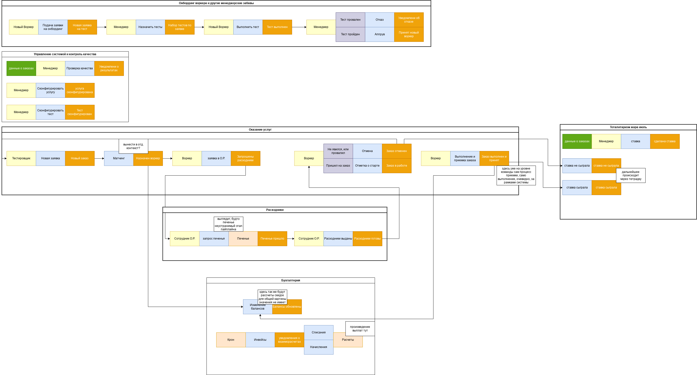

# Event Storming

Исходя из требований, у нас имеются следующие акторы
- Менеджеры
- Клиенты (Тестировщики)
- Воркеры
- Сотрудники Отдела Расходников (О. Р.)

Потоки взаимодействия:
- Менеджер конфигурирует доступные Услуги;
- Тестировщики делают Заказы на Услуги, система матчит Заказы с Воркерами, Воркеры выполняют/проваливают заказ;
- Воркеры делают заявку на сбор Материалы через О. Р. (а еще О. Р. заказывает печенье, учтем);
- Онбординг (найм) новых Воркеров осуществляется через процесс тестирования Менеджером;
- Менеджер производит назначение Тестов для Нового Воркера, а еще конфигурирует эти самые Тесты;
- Воркер выполняет Тест, либо попадает в пул Воркеров, либо нет;
- Заказы могут быть предметом Тотализатора, который ведет учет сыгранных Ставок на Заказы;
- Все Расчеты происходят асинхронно.

# Domain context

Исходя из этих вводных, можно выделить следующие контексты (и домены):
- Оказание Услуг — все, что связано с оказанием услуг и работой с Заказом
- Расходники — часть процесса подготовки Заказа по Материалам, тут скорее всего своя инвентаризация, поэтому хорошо бы с ней отдельно...
- Бухгалтерия — она же биллинг, поскольку расчеты происходят асинхронно (нет оплаты in-place), она способна «питаться» событиями и накапливать данные до момента расчетов.
- Тотализатор — тоже вынесен отдельно, исходя из требований не должен оставлять «следов» в системе, удобно сделать его «в стороне», получать необходимые данные из событий...
- Онбординг воркера — процесс тестирования и приема новых Воркеров, вынесен как контекстуально (вырисовывается очевидный BC), так еще и есть риски, связанные с потенциально высоким RPS.
- Управление системой и контроль качества — в некотором смысле, пульт управления системой, ее конфигурации, здесь же и вопрос контроля качества.

Итого, по сумме, коммуникации в любом стиле построения системы (монолит либо SoA/микросервисы) стоит сделать в асинхронном стиле.

# Модель данных

Контексты владеют следующими моделями (являются источниками):
Исходя из этих вводных, можно выделить следующие контексты (и домены):
- Оказание Услуг — Заказ, Клиент и Воркер, использует Услугу для создания Заказа, отражает балансы счетов Клиента и Воркера
- Расходники — Сотрудник О. Р., Материалы, использует Заказ
- Бухгалтерия — Счет и Транзакция, использует Клиента и Воркера для связи
- Тотализатор — Ставка, использует Менеджера
- Онбординг воркера — Заявки на тестирование, использует Менеджера (управление решением) и Тест воркера (формирование теста)
- Управление системой и контроль качества — Менеджер, Услуга, Тест Воркера, Контроль качества, использует Заказ (контроль качества)

# Итоговый дизайн системы

Система видится как набор из четырех сервисов:
- Сайт для онбординга: тестирование, проверка, результаты
- Основной монолит:
  - Оказанием услуг/дашборд для клиента и воркера;
  - Модуль Отдела расходников;
  - Модуль Биллинга;
  - Админка для Менеджеров с управлением тестами, услугами, а так жеконтролем качества;
- Тотализатор
- Технический сервис для нотификаций.

Такой расклад должен обеспечить высокий TTM + выделить текущие «сложные» места системы либо в отдельный сервис, который не положит систему, либо спрячет что-то от посторонних глаз.

Из сложных моментов:
- Есть общая неуверенность по схеме
- есть ощущение, что, возможно, Биллингу (Бухгалтерии) стоило бы чего-то добавить, но из требований не проглядывается;
- Возможно, управление и контроль качества стоило бы пересмотреть, получилось очень много связей;
- Неизвестно, насколько так получится соблюсти требуемые темпы по TTM;
- Слабо расписан тотализатор, возможно, там стоит оставить только описание процесса ставок, т.к. остальное просто процесс накопления данных;
- Неуверен насчет отдельного сервиса нотификаций, но в целом, учитывая возможный RPS на сайте, лучше увести отдельно от основной системы.

Критичное:
- Сайт тестирования видится как отдельный, поскольку есть риск нагрузок
- Тотализатор тоже