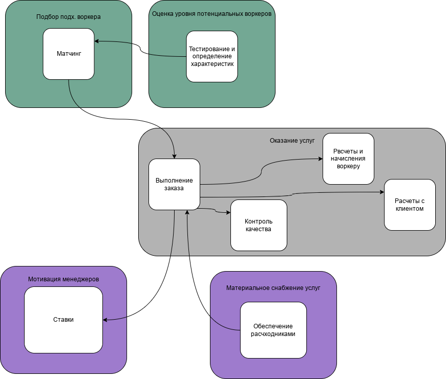

# Работа над ошибками

## Найденные поддомены и боундед-контексты

### Было во второй домашке до проверки

> - Оказание услуг (core subdomain):
>   - Контекст оказания услуги клиенту (я не знаю как это назвать лучше)
>   - Матчинг (является core feature наряду с процессом выполнения заказа)
> - Управление материалами (supporting subdomain):
>   - Расходники (долго думал, выделять ли это частью core domain, но все же не лезет оно туда, пусть это неустранимая часть pipeline, мне кажется, это такая ловушка =)
> - Устройство кота в штат MCF (supporting subdomain):
>   - Тестирование и определение характеристик кота
> - Тотализаторная мотивация (supporting subdomain):
>   - Ставки
> - Обеспечение клиентской удовлетворенности (supporting subdomain):
>   - Контроль качества
> - Расчеты (generic) (мне кажется, биллинг и расчеты могут быть частью какого-нибудь 1С или SAP)

[изначальное описание](doc.md)

### После разбора

Выяснилось, что я совершенно упустил суть core subdomain, совершив следующие ошибки:
- Не определил тестирование потенциальных котов-воркеров как core subdomain, в то время как, исходя из требований, данный поддомен является (наряду с системой матчинга) ключевым преимуществом для бизнеса
- Посчитал, что оказание услуг является core subdomain. В каком-то смысле, само оказание таковым является, но не реализация системы, обслуживающая этот процесс

Корень ошибок кроется в неверном анализе системы: главная ошибка, на мой взгляд, в непонимании, как на самом деле выделяются ключевые поддомены: это не только (и часто не столько) «соль» того, что предоставляет компания (в данном случае, оказание услуг), **а ключевые особенности бизнеса, дающие конкурентные преимущества, уникальные и сложные в реализации** *(странно, ведь и урок читал, и Хононова, а дошло только после разбора...)*

Таким образом, при анализе я упустил важный поддомен, и сконцентрировался на «основном» бизнес-процессе

Еще ошибки:
- По большей части, в определениях дал изолированным контекстам имена, больше тянущие на имена поддоменов, и наоборот
- Выделил Обеспечение клиентской удовлетворенности в отдельный домен, но контроль качества является частью процесса оказания услуг
- Заполнил core domain chart bounded-контекстами, а не доменами
- Выделил биллинг (расчеты) в отдельный поддомен, хотя расчеты являются частью оказания услуг
- Не сделал вот эти таблички (и вообще, прошел по касательной эту часть работы):

|Subdomain|Complexity|Differentiantion|Type|
|---------|---------|---------|---------|
|Подбор подходящего воркера|High|High|Core|
|Оценка уровня потенциальных воркеров|High|High|Core|
|Оказание услуг|High|Low|Generic|
|Мотивация менеджеров|Low|Low|Supporting|
|Материальное снабжение услуг|Mid|Low|Supporting|

|Subdomain|Bounded Context|
|---------|---------|
|Подбор подходящего воркера|Матчинг|
|Оценка уровня потенциальных воркеров|Тестирование и определение характеристик|
|Оказание услуг|Выполнение заказа|
|Оказание услуг|Контроль качества|
|Оказание услуг|Расчеты и начисления воркеру|
|Оказание услуг|Расчеты с клиентом|
|Мотивация менеджеров|Тотализаторные ставки|
|Материальное снабжение услуг|Обеспечение расходниками|

Обновим чарты:

ES почти и не пострадал =)

