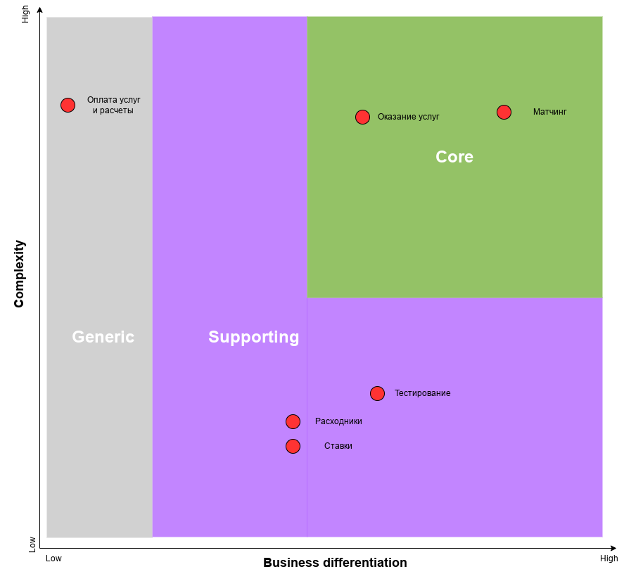
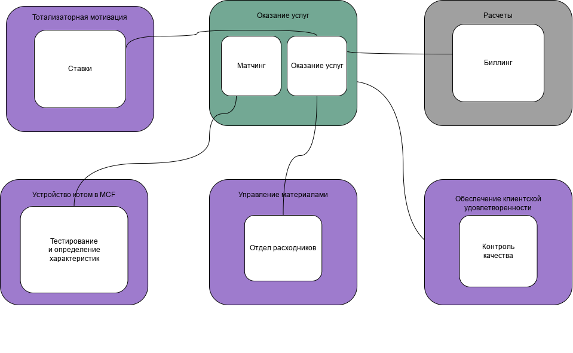
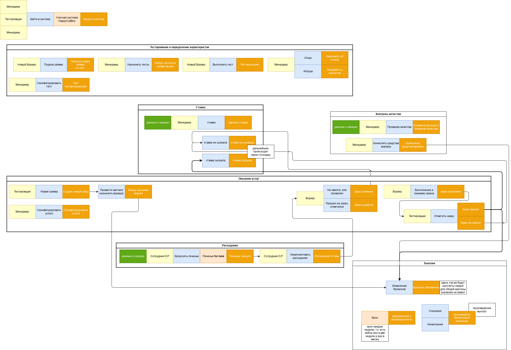

# Еще раз о требованиях

Исходя из требований, у нас имеются следующие акторы
- Менеджеры
- Клиенты (Тестировщики)
- Воркеры
- Сотрудники Отдела Расходников (О. Р.)

Потоки взаимодействия:
- Менеджер конфигурирует доступные Услуги;
- Тестировщики делают Заказы на Услуги
- Матчин матчит Заказы Эталонных Образцов с Обычными Образцамж
- Воркеры делают заявку на сбор Материалы через О. Р. (а еще О. Р. заказывает печенье);
- Воркеры выполняют/проваливают заказ;
- Онбординг (найм) новых Воркеров осуществляется через процесс тестирования Менеджером;
- Менеджер производит назначение Тестов для Нового Воркера, а еще конфигурирует эти самые Тесты;
- Воркер выполняет Тест, либо попадает в пул Воркеров, либо нет;
- Заказы могут быть предметом Тотализатора, который ведет учет сыгранных Ставок на Заказы;
- Все Расчеты происходят асинхронно.

# Найденные поддомены и боундед-контексты

- Оказание услуг (core subdomain):
  - Контекст оказания услуги клиенту (я не знаю как это назвать лучше)
  - Матчинг (является core feature наряду с процессом выполнения заказа)
- Управление материалами (supporting subdomain):
  - Расходники (долго думал, выделять ли это частью core domain, но все же не лезет оно туда, пусть это неустранимая часть pipeline, мне кажется, это такая ловушка =)
- Устройство кота в штат MCF (supporting subdomain):
  - Тестирование и определение характеристик кота
- Тотализаторная мотивация (supporting subdomain):
  - Ставки
- Обеспечение клиентской удовлетворенности (supporting subdomain):
  - Контроль качества
- Расчеты (generic) (мне кажется, биллинг и расчеты могут быть частью какого-нибудь 1С или SAP)

# Расхождения

1. Представлен Матчинг как core subdomain b-context
2. Убрано Управление системой и контроль качества, основные команды оттуда были отданы в соотв. контексты, остался Контроль качества как отдельный домен. Думаю, я исходил из технической целесообразности («админка» для менеджеров напрашивалась), после понял, что так это не делается

# Характеристики системы

- agility, testability и deployability — низкий ТТМ из ТЗ
- modifiability и evolvability — из ТЗ: «Для бизнеса критично проверять новые гипотезы по отсеву котов и изменять уже существующие с максимальной скоростью и надёжностью.»
- scalability и maintainability — из ТЗ: «Мы ожидаем 1к заявок в день от рандомных котов, также, судя по отзывам, наши конкуренты могут попытаться нас заддосить в этом месте. Они так делали уже несколько раз с другими компаниями, после чего компании закрывались с позором.»

# Архитектурный стиль

Изначально, мной предполагалось следующее:

> Система видится как набор из четырех сервисов:
> - Сайт для онбординга: тестирование, проверка, результаты
> - Основной монолит:
>   - Оказанием услуг/дашборд для клиента и воркера;
>   - Модуль Отдела расходников;
>   - Модуль Биллинга;
>   - Админка для Менеджеров с управлением тестами, услугами, а так же контролем качества;
> - Тотализатор
> - Технический сервис для нотификаций.

По мере уточнения понимания бизнеса и общей картины системы (и терминологии), выходит, что наиболее адекватный архитектурный стиль системы — микросервисный

Этот выбор исходит из требований к системе: у нас есть сайт для заявок котов-воркеров, потенциально подвержернный нагрузке, которую хотелось бы изолировать, есть основная доменная система (матчинг и оказание услуг), есть отдельный тотализатор, в то же время, сокращение расходов как критичный фактор бизнесом не был заявлен =)

# Итоговая модель системы
*переделать модели данных*

*сделайте итоговую модель системы, укажите виды коммуникаций между элементами, если выбрали распределённый стиль.*