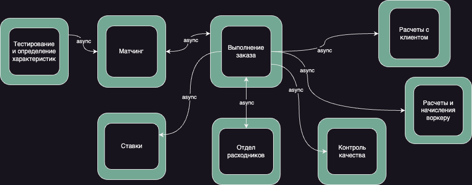
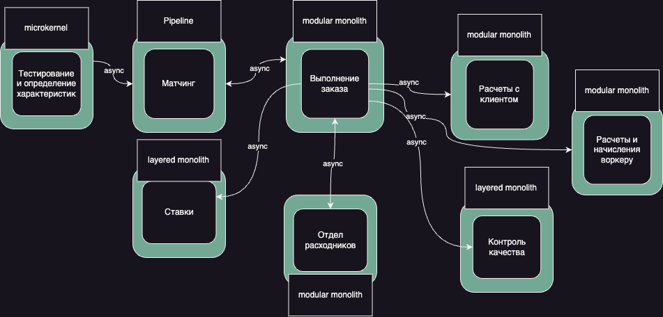

# Работа над ошибками

Не был разделен биллинг, исправим это:

# Архитектурный стиль
Использование EDA в нашем случае оказалось невозможно, я совершенно забыл, что сам назначил в паре мест синхронную коммуникацию, исключающую EDA =)

В итоге, архитектурный стиль – microservices.

# ADR
В разборе домашки был упомянут кейс с вынесением контекста контроля качества в отдельный сервис, в ключе того,
что это в принципе ОК, но, ввиду общности данных и общего поддомена, это требует некоторого пояснения, для чего напишем еще один ADR =)

[ADR](adr-quality.md)
