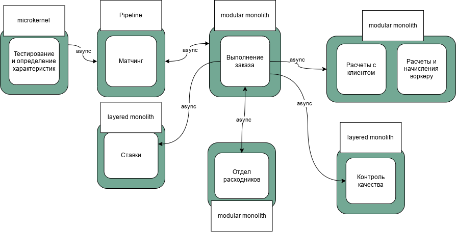

# Стейкхолдеры и их группировка ~~Ленинград~~

- Топ-менеджмент
- Менеджеры
- Клиенты (коты-тестировщики)
- Финансовый отдел
- Юристы
- Админы
- Разработчики, куда же без ~~нас~~ них
- (фантазируем) работники отдела расходников
- (фантазируем) работники отдела матчинга

Ключевые консерны:
- Топ-менеджмент:
  - скоринг потенциальных работников уникален в своём роде, и логика его работы сильно выше, чем планировалось. Бизнес в будущем хочет продавать его другим компаниям и тестировать больше гипотез;
  - релизный цикл для всей системы — месяц, для скоринга работников — неделя максимум.
- Финотдел: 
  - списывать деньги с клиентов каждую неделю слишком затратно для отдела, поэтому они хотят списывать деньги раз в месяц, но платить воркерам и дальше раз в месяц. При этом необходимо постоянно добавлять новые способы списания денег для клиентов. Воркеры всегда работают через компанию «Золотая шляпа»;
  - боятся потерять любую финансовую информацию и хотят решение, которое будет гарантировать, что всё будет ок.
- Менеджеры:
    - хотят, чтобы о системе ставок не знали другие отделы, иначе будет некрасивая ситуация. Они хотят скрыть эту систему даже от разработчиков, которые не будут ей заниматься, и от начальства;
    - выяснилось, что котам из Happy Cat Box наш проект понравился, поэтому приходит не 10 заказов в день, а 10 заказов в минуту.

# Выбор архитектурного стиля ~~(барокко)~~

Общий стиль видится мне как event-driven, на это повлияли следующие соображения:
- У нас нет требований, которые бы прямо исключали этот вариант.
- Ряд консернов стейкхолдеров:
  - Скоринг лучше выделять в отдельный сервис, он критичен и в будущем будет возможно отдельным бизнесом.
  - Обеспечение требований финотдела реализуется проще в изолированной среде.
  - Админам и разрабам будет проще чинить изолированные от других части системы.
  - Тотализатор, который будет потреблять события, можно легко скрыть таким образом.
- Юный Архитектор прошел курс АА5 =)

По сервисам:
- С учетом требований к скорингу, выбран microkernel, т.к. возможно расширение логики
- Под map-reduce подход в матчинге хорошо подойдет pipeline
- Выполнение заказа, расходники и сервис по расчетам будут модульными монолитами, там важен контроль логики
- Ставки и контроль качества могут быть реализованы в виде layered монолита.

- agility, testability и deployability — общие требования к системе
- modifiability и evolvability — требования к скорингу и матчингу
- scalability, maintainability, performance — требования к скорингу
- **NEW** constistency — требование к расчетам

# Выбор вида базы данных
- Расчеты, очевидно, RDBMS
- Матчинг — графовая БД (должна сочетаться с map-reduce)
- Скоринг — RDBMS
- Выполнение заказа, ставки, расходники и контроль качества — RDBMS

RDBMS, при прочих равных, наиболее распространенное решение для хранения данных, кроме того, например, PostgreSQL обладает рядом отличных и уже проверенных временем NotOnlySQL расширений (JSONB для слабоструктурированных данныз, HSTORE как key-value, *TimeScaleDB как time-series, гыгы)*, что позволяет обеспечить гибкость без значительного изменения сервиса, а еще у нас нет ярко выраженных требований по данным сервисам, которые бы аффектили выбор хранилища данных.

# Выбор вида коммуникации

С учетом выбранного стиля, коммуникации асинхронны

# ADR

[ADR в отдельном документе](adr.md)

# Fitness

- test-coverage > 80% *(я реалист, кроме того, важность coverage в отрыве от других способов контроля качества кода несколько переоценена)*
- общая проверка качества кода с применением разнообразных линтеров
- релиз-циклы:
  - раз в неделю для скоринга
  - раз в месяц для всей остальной системы
- schema-registry
- анализ метрик coupling/cohesion
- анализ метрик работоспособности приложения (observability), построение анализа инцидентов по сервисам

