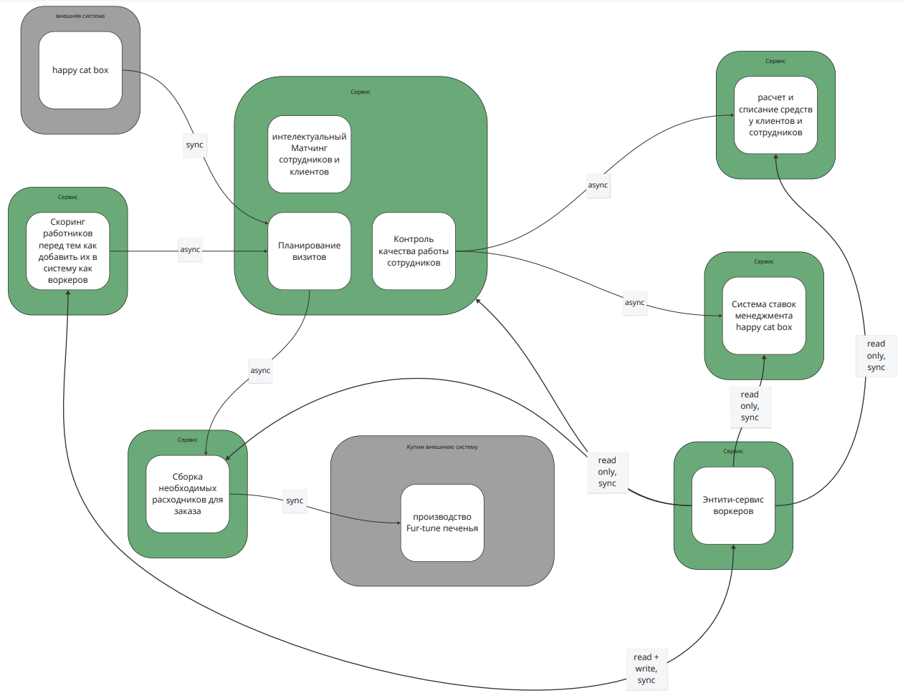
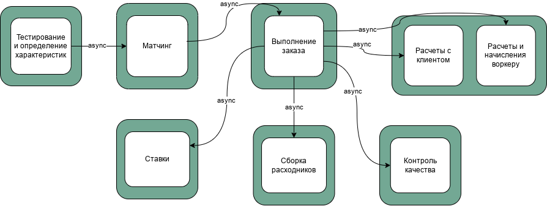
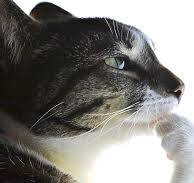
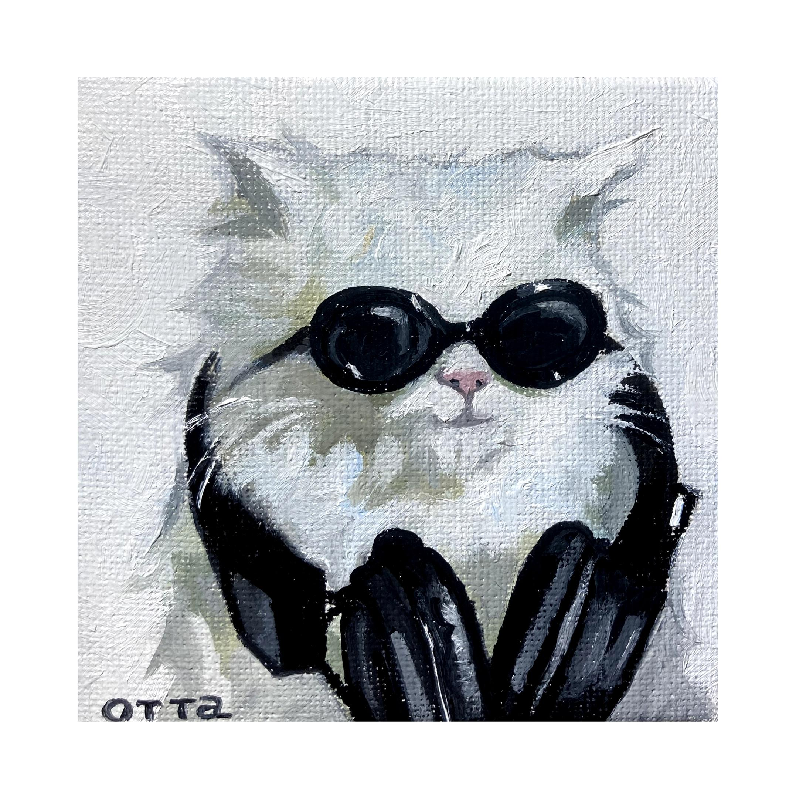

# Текущее состояние
Была взята система, предложенная в описании домашнего задания

Что мы хотим получить:

# instability
- сборка расходников: 1/2+1 = 1/3 = ~0.33
- скоринг: 1/1+1 = 1/2 = 0.5
- ентити воркеров: 3/3+1 = 3/4 = 0.75
- расчеты: 0/2+0 = 0
- визиты: 1/2+1 = ~0.33
- контроль качества: 2/2+0 = 1

# Изменения
- распил монолита из матчинга/контроля качества/визитов на отдельные сервисы
- разделение расчета (но в рамках одного и того же сервиса, просто зафиксировать)
- избавимся от entity сервиса воркеров, сделаем воркеров частью системы выполнения заказа
- Я не описал внешние системы, каюсь, добавлять впопыхах уже не стану, но в целом понятно, что их присутствие более чем оправдано (HCB у меня даже неявно в ES есть)

# Планируем: нет опыта/инфраструктуры
1. Вынесем контроль качества: проще всего тренироваться на нем, стратегия: Tactical Forking, структуру БД не меняем
2. Выносим визиты, наделяем обязанностью быть источником по воркерам, стратегия: Strangler Fig Application
3. Выносим матчинг, подход Change Data Capture

# Планируем: нет свободных ресурсов/людей
1. Выносим матчинг, подход Change Data Capture
2. Выносим визиты, наделяем обязанностью быть источником по воркерам, стратегия: Strangler Fig Application
3. Вынесем контроль качества: проще всего тренироваться на нем, стратегия: Tactical Forking, структуру БД не меняем

