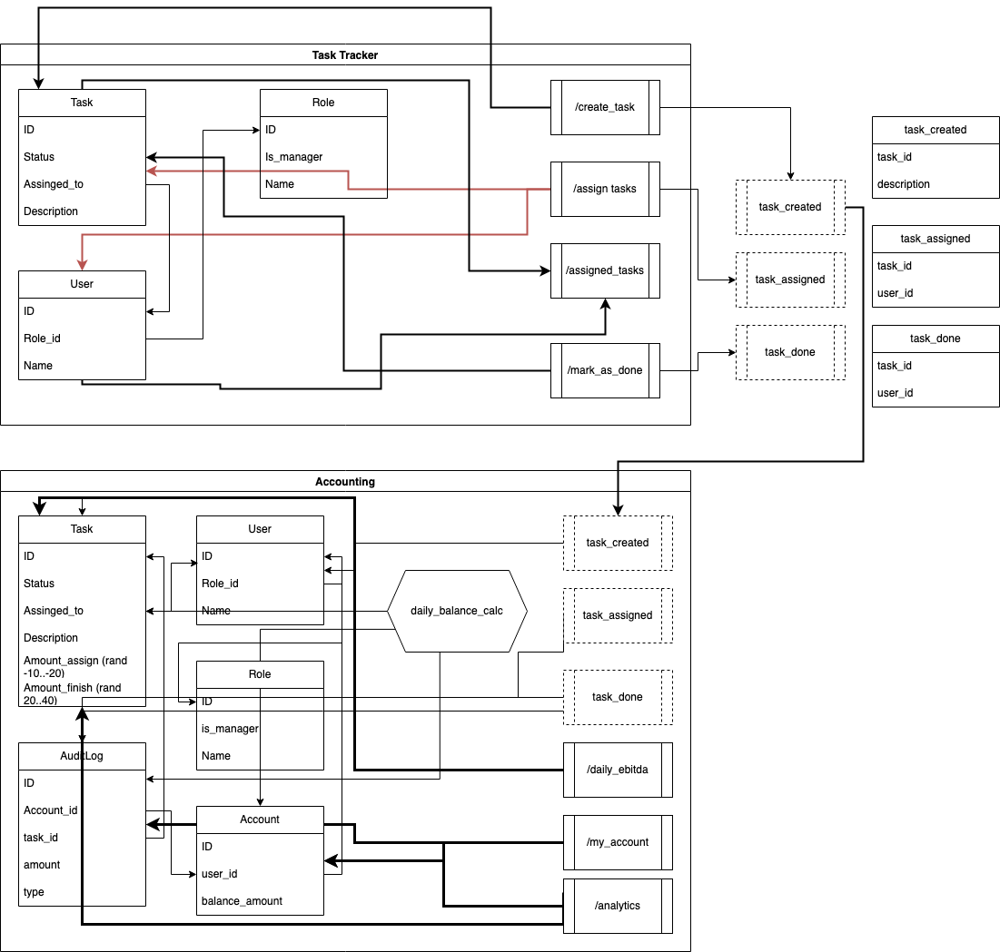

# Р-е-ф-л-е-к-с-и-я (https://www.youtube.com/watch?v=uLAf9eX_KY8)

Рассмотрим, что у нас есть с «нулевой» домашки:

[Схема](../0/0.drawio.svg)

[Заметки](../0/notes.md)

Не так много... Но, можно рассматривать общий импакт на мое сознание и образование с чуть более отдаленной точки, включающей в себя не только курс анализа систем, но и ранее пройденный курс по асинхронной архитектуре, ибо там результат нулевой домашки выглядел как-то так:

Какие у меня были вводные ожидания от курса?

Нужно сказать, что я искал системности в анализе систем, простите за тавтологический каламбур, поскольку строить что-то рамках одного сервиса и писать код я умел, а вот грамотно все это проектировать (стратегически), я не умел, это была одна из моих болей наряду с пробелами в фундаменталс оф компьютер сайенс (то бишь, алгоритмами, структурами данных, да и, по-крупному, ориентации в паттернах, которые мы в рамках данного курса отнесем к тактическим [всякие штуки типа GoF, etc])

Курс АА5 дал мне крупный пинок и экскурс в глубины моего незнания, поэтому до него я был словно чистый лист в этой части познания. Тем не менее, после прохождения курса, я ощутил жуткую неудовлетворенность, «голод» по первой его часть, по анализу, ES, и всему такому. Поэтому, когда объявили набор на АС2, я долго не думал =)

Что можно сказать про АС2? Ну, начнем с болей и нытья:
- Умудрился промахнуться с выбором стиля системы, хотя, вроде бы, должен был хорошо после АА5 ориентироваться в происходящем и не выбирать EDA имея синхронные коммуникации
- Кажется, довольно сильно накосячил с моделью данных, кажется, это одна из самых недопошлифованных мной в сознании (из осознаваемых, разумеется) деталей анализа
- Я получил больше ЕС, и вообще массу всего нового, но, все равно, мало =)

Из однозначно хорошего:
- Отдельно отмечу, что помимо основной темы курса, я получил множество знаний, практик, «лайфхаков», это супер!
- Я получил совершенно иное представление об анализе систем, требований, подходах ко всему этому, чего ранее не мог даже представить: разрозненные, обрывочные знания превратились в некое подобие структурированного знания (подобия потому, что это еще предстоит привести в порядок, обучение только началось)
- Более-менее освоил ЕС, устранив во многом недосказанности с курса АА5
- В частностях:
  - С другой стороны посмотрел на подход к работе со стейкхолдерами
  - С другой стороны посмотрел на процесс выбора архитектуры системы и ее отдельных элементов, основанный на характеристиках (одно из ключевых новых знаний лично для меня)
  - С другой стороны посмотрел на процесс фиксации решений (ADR), хотя мы у себя их используем, все равно, полученные знания гораздо шире
  - Получил огромное количество информации о DDD, с которым ранее сталкивался лишь в тактической части
  - Вынес для себя в деталях процесс анализа проблематики бизнеса через выделение поддоменов и построения решений через выделение ограниченных контекстов
- Масштабно пополнил библиотеку и инструментарий

Все изученное, кажется, довольно сильно может помочь на работе, где передо мной (да и командой в целом) стоят задачи как раз рассматриваемые курсом =)
